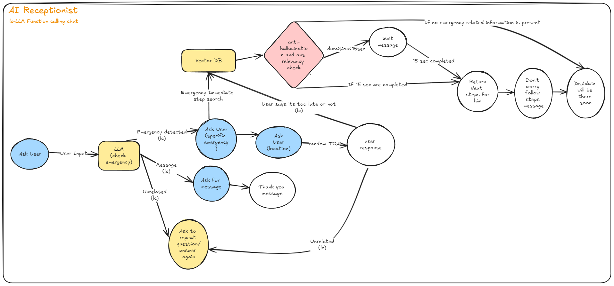

# AI Receptionist

## Intructions Followed
You need to build a helpful AI receptionist for a doctor that is available on text.

1.In the first node you need to confirm from the user if they are having an emergency or they would like to leave a message.<br>
2.In the second node if its a message, you need to ask the user for the message. If its an emergency, you need to first confirm what is the emergency.<br>
3.If the given emergency is in your vector database (like qdrant or whatever you want), you need to, based on the emergency, provide an immediate next step to the user to do while the doctor calls the user back. Eg. If the patient is not breathing - then do CPR - details of what CPR is. This call to the database needs to be artificially slowed down by 15 seconds.<br>
4.While the call to the database is happening, you need to continue the conversation saying, “I am checking what you should do immediately, meanwhile, can you tell me which area are you located right now?”<br>
5.Once the user gives the area, then tell the user Dr. Adrin will be coming to their location immediately. Give a random estimated time of arrival.<br>
6.If the user says that the arrival will be too late, then return the response from point 3 and tell them to follow those steps while the doctor comes so that the patient gets better. Eg. “I understand that you are worried that Dr. Adrin will arrive too late, meanwhile we would suggest that you start CPR, i.e. pushing against the chest of the patient and blowing air into his mouth in a constant rhythm”. If by the time you reach step 6, 15 secs is not complete in point 3, then wait for point 3 by saying “Please hold just a sec”<br>
7.If in point 2 it was just a message, then ask the user for the message. And after receiving the message say “Thanks for the message, we will forward it to Dr. Adrin”<br>
8.If it was an emergency, post point 6 say “Don’t worry, please follow these steps, Dr. Adrin will be with you shortly”<br>
9.If at any point the user says something unrelated, say “I don’t understand that and repeat the question/statement”<br>

# Flowchart


## Functions

### `get_input_async(prompt: str) -> str`

Asynchronously retrieves user input based on the provided prompt.

### `call_llm_async(prompt: str, tools: Dict[str, Any], context: str) -> Dict[str, Any]`

Asynchronously interacts with a language model to get a response based on the provided prompt and tools.

### `rag_search(emergency_ask: str) -> list`

Performs a search based on the emergency query and returns relevant actions or information. The function returns an empty list if no relevant results are found.

### `unrelated_message()`

Displays a message indicating that the system does not understand the input and prompts the user to provide more information.

### `closing_node()`

Displays a closing message indicating that assistance will be provided shortly.

### `node2A()`

Handles emergency scenarios, determines actions based on user responses, and calculates estimated arrival time for assistance.

### `node2B()`

Handles scenarios where the user wants to leave a message for the recipient.

### `node1(unrelated: bool = False)`

Initial function that determines whether the user's input is related to an emergency, a message, or something unrelated, and routes the input accordingly.

## How to Run

1. Ensure that you have all the required dependencies installed. You can install them using:

    ```bash
    pip install -r requirements.txt
    ```

2. Set up your environment variables. Make sure to include the `GOOGLE_API_KEY` and `GEMINI_MODEL` (Model selected should support function calling) in .env.

3. Run the main script:

    ```bash
    python main.py
    ```
